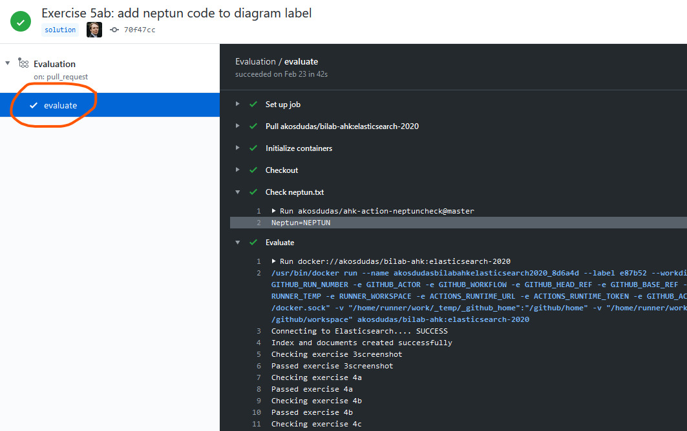
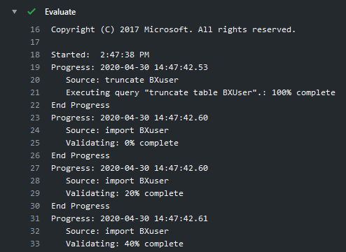

# GitHub Actions

The automatic evaluation of your submissions uses [GitHub Actions](https://github.com/features/actions). It is a CI/CD and workflow automation platform that enables us to execute and test your code in a virtual environment.

The evaluation will give you feedback in your pull request. In case you need more information, or want to see the application logs, navigate to your GitHub repository in a web browser and click _Actions_.

The interface will list so-called _Workflows_. Every execution will be a new item in this list (thus it also gives you access to past executions and their logs).

Selecting one of these (e.g. the topmost is always the last one) gives you the details. To get the logs, you need to click one more on the left, then the logs will be on the right.

Ever green check mark is a successful step in the process. These steps do not correspond to your exercises; these are the steps of the evaluation process, such as the initialization of the environment.

Generally each task shall succeed, even if there are errors in your submission. These errors should be expected and handled by the process. There is only one exceptions to this rule: if `neptun.txt` is missing; evaluation will not proceed if this file is not correct.

There can be transient errors though, such as a temporary network or git error. In such case you can re-run the evaluation. Naturally, re-running will only resolve transient errors. You can deduce the nature of the problem from the step name and the log itself.

You can also look at the execution log of the evaluation. In case of Microsoft SQL Server Integration Services this will provide you with the log of the ETL execution. (In other cases the logs can be different.)

