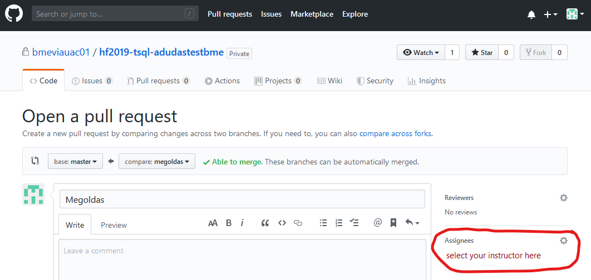

# Submitting your work

We are using GitHub for submitting the solutions. This guide explains how to use GitHub and pull requests.

## Starting your work: git checkout

1. [Register](https://github.com/join) a GitHub account, if you don't have one yet.

1. Open the link in the exercise description to create your repository.

1. If needed, authorize the _GitHub Classroom_ application to use your account data.

   

1. You will see a page where you can "Accept the ... assignment". Click the button.

   

1. Wait for the repository creation to finish. You will get the repository URL here.

   > The repository will be private. No one but you and the instructor will see it.

   

1. Open the repository webpage by following the link. You will need this URL, so remember it.

   

1. Clone the repository. You will need the repository git URL, which you can get from the repository webpage following the _Clone or download_ button.

   > You may use any git client. If you do not have a favorit yet, the simplest one is [GitHub Desktop](https://desktop.github.com/). You can list your repositories in this application directly from GitHub.

   

   If you are using console, the following command performs the clone (if the `git` command is available): `git clone <repository link>`

1. If the cloning is successful, **DO NOT START WORKING YET!** The solution should _not_ be committed to the repository `master` branch. Instead, create a new branch with the name `solution`.

   In GitHub Desktop, use the _Branch_ menu for creating a new one.

   

   If using console, use the following command: `git checkout -b solution`

1. Complete the exercises on this branch. You may have any number of commits and pushes.

   To commit using GitHub Desktop, first check if you are on the right branch. During the first push, the _solution_ branch needs to be published.

   

   When adding further commits, verify the branch. You can publish the commit using the _Push origin_ button. The little number of this buttons shows you how many commits need pushing.

   

   If you are using console, use the following commands:

   ```bash
   # Check the current branch and the files modified
   git status

   # Prepares all changes for commit
   git add .

   # Commit
   git commit -m "f1"

   # Push the new branch (first time)
   git push --set-upstream origin solution

   # Push futher commits
   git push
   ```

## Submitting the solution

1. When you are ready with the exercises, verify on the repository web page that you uploaded everything. You may need to switch branches.

   

   > Please do **NOT use** GitHub web file upload. If something is missing, add it to your local repository and commit and push again.

1. When you are truly ready, open a _pull request_.

   > This _pull request_ combines all changes you made, and shows us the final result. This helps the laboratory instructor to evaluate your submission more easily. This _pull request_ means you submit your solution, hence this step **cannot be omitted**.

   To open the _pull request_ you need to go to the repository's GitHub web frontend. If you pushed recently, GitHub will offer you to create the pull request..

   

   You may also open the _pull request_ from the menu at the top. It is important to specify the correct branches: `master` is the target into witch `solution` is merged.

   

1. When the _pull request_ is created, you will see a little number "1" on the _Pull request_ menu showing you that there is one open item there. **YOU ARE NOT FINISHED YET!**

   

1. The _pull request_ will trigger a preliminary evaluation. You will see the result in a comment in the _pull request_ thread.

   

   This evaluation may differ from the image. And it may take some time.

   If you need more information about the evaluation and the results, _GitHub Actions_ can provide you more. See the short guide [here](GitHub-Actions-usage.md).

1. If you are not satisfied with your work, you can make further changes. You only need to commit and push your changes continuing to work on the correct branch. Any changes pushed will re-trigger the evaluation of the _pull request_. We ask that you trigger **NO MORE THAN 5 evaluations**!

   > If you want to make changes to your submission and not have the re-evaluation run, you should **close the pull request**. When you are finished, you can open a new one instead.

1. **FINALLY**, when you are ready, assign the _pull request_ to your laboratory instructor. This step is considered as the submission of your work.

   

   > If you have no pull request, or it is not assigned to the instructor, we consider it work in progress and not submitted.

1. Now you are ready. After assigning the pull request, **make no further changes**. The instructor will evaluate the submission and close the pull request.

## Questions and complaints regarding the final result

If you have questions on concerns regarding the automated evaluation, use the pull request for communication with the instructor by asking questions via comments. To let the instructor know you have questions, please use `@akosdudas` [mention](https://help.github.com/en/github/writing-on-github/basic-writing-and-formatting-syntax#mentioning-people-and-teams) in the PR comment. This will automatically send an email notification.


Please note, that if you think the evaluation made a mistake, you are required to support your question/complaint with proof (e.g. show how you tested your solution and prove that it worked).

## Possible issues and their resolution

If you are faced with a problem, read the followings.

If you still have an error, first, please seek to resolve it on your own. The laboratory instructors are available to help, but if you ask something that is clearly explained in the exercises, help will only be give in exchange for minus points.

#### You cannot find your repository

Go to www.github.com and after login you will see the list of your repositories on the left.

#### You got an email with "run failed" / the pull request contains "checks have failed"

After each commit you push, a minimal set of tests are executed for verification. This email tells you that these checks have failed. You must fix these. In the email you will find a link "View results". In the pull request, there is a "Details" link. You can check the logs of the execution here and look for red X-es marking the errors.

#### You do not know that is the problem in your solution / you do no not understand the error message received

It is not our goal with the evaluation to explain the problems exactly. It is part of your work to evaluate and test your own solution. The error message can also come from the actual execution of your work and comes from the tools used.

#### You finished your work but got no evaluation / grade

Did you: commit? push? open the pull request? assign it?
