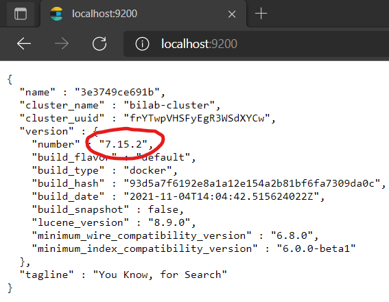

# Exercise 2: Initializing Elasticsearch and Kibana

The purpose of this exercise is to start _Elasticsearch_ and _Kibana_. You have two options for running them:

1. Using Docker
1. Or install them on your machine.

In the university computer laboratories use the Docker option. Otherwise choose the option best suited for you (if you don't have Docker, you can just go with option #2).

## Option 1: Start _Elasticsearch_ and _Kibana_ using Docker

If you have Docker, or you are working in the university computer laboratories, use this option.

1. Start Docker Desktop and wait for it to initialize.

1. **Only in university computer laboratories**: open Docker Desktop settings (right-click on the Docker icon on the taskbar), and follow the teacher's instructions to configure a proxy to be used by Docker.

1. Open a command prompt or PowerShell console and test whether Docker is working: execute `docker version`, which should print version information for client and server.

1. Locate the provided `docker-compose.yml` file in the checked-out starter solution (located in the root of your git repository). Open it in a text editor of your choice and check its contents. Check the following specifics:

    - `environment`: This is used to set environment variables in the container. We can use these to provide some settings for _Elasticsearch_ and _Kibana_ as well. One example is the `cluster.name` variable.

    - `ulimits`: In order for _Elasticsearch_ to function properly, we have to set some `ulimit` values in the container.

    - `volumes`: Due to how file storage works in _Docker_ containers, every data is lost if we remove a container and start a new one. Of course, this is not exactly appropriate for a database service like _Elasticsearch_. Therefore we are going to use a `volume` which provides a more durable storage option.

1. Navigate a command prompt / PowerShell / bash shell into the folder with the `docker-compose.yml` file, and issue the following commands.

    If you are in the university computer laboratories, please run `docker-compose down -v` first to remove any lingering containers and data left behind.

    Then to start, use `docker-compose up`.

    !!! tip ""
        If you are using Linux, and this command fails, you might try to `sudo` to make things easier.

    Keep this shell open. You will see the application logs here.

1. To shut down the running system, use _CTRL + C_. Your data will be kept, and restarting with the same command as above will restart the applications.

    To completely shut down the applications and remove all data, use `docker-compose down -v`.

## Option 2: Start _Elasticsearch_ and _Kibana_ by installing them

1. Download the **OSS** version of [Elasticsearch](https://www.elastic.co/downloads/past-releases/elasticsearch-oss-7-10-1) and [Kibana](https://www.elastic.co/downloads/past-releases/kibana-oss-7-10-1). Please make sure to use **version 7.10.x**; the starter code and the instructions might be specific to this version.

1. Extract the archives.

    !!! note ""
        Extracting the zip files will take a considerable amount of time.

1. Start both using the executables `bin/elasticsearch(.bat)` and `bin/kibana(.bat)`. There is no configuration needed; the default setup will work fine

1. Wait for a few seconds while they start.

    Elasticsearch will print something like this:

    ```
    [INFO ][o.e.h.AbstractHttpServerTransport] [xx] publish_address {127.0.0.1:9200}, bound_addresses {127.0.0.1:9200}, {[::1]:9200}
    [INFO ][o.e.n.Node               ] [xx] started
    ```

    Note the port where Elasticsearch is available (should be 9200).

    Kibana, when ready, will print:

    `[info][server][Kibana][http] http server running at http://localhost:5601`

    If you need to change the ports, edit the following files, then restart the applications:

    - `config\elasticsearch.yml`, look for key `http.port`, uncomment it and set a port;
    - `config\kibana.yml`, look for key `elasticsearch.hosts`, uncomment it and set the same port.

## Check that the systems are running

1. Open a browser of your choice and navigate to <http://localhost:9200> to verify that Elasticsearch is up and running. Make sure to check the **version** and the **build_flavor** too!

    

1. Open a browser of your choice and navigate to <http://localhost:5601>. You should see _Kibana's_ starting page. Choose the "Explore on my own" option to get to the landing page.

    
