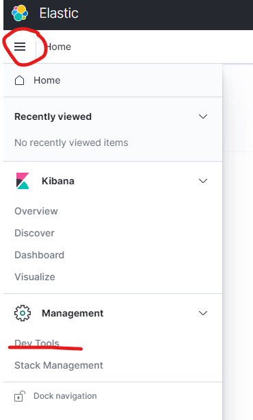
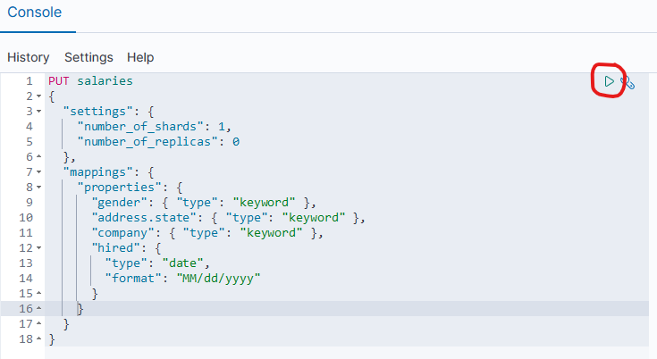
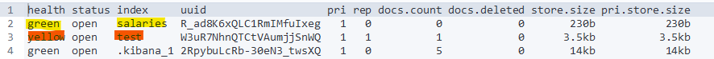
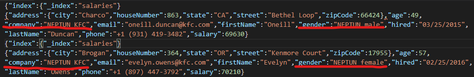
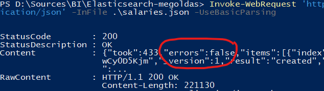

# Exercise 3: Initializing Elasticsearch

Now that both _Elasticsearch_ and _Kibana_ are operational let us create the necessary indices for us to work with in the following exercises.

## Index a document via _PowerShell_

First, we are going to use _Elasticsearch's_ REST API through _PowerShell_.

1. To index a document in _Elasticsearch_, issue the following command.

    ```powershell
    (Invoke-WebRequest 'http://localhost:9200/test/_doc/1?pretty' -Method Put -ContentType 'application/json' -Body '{ "name": "John Doe" }' -UseBasicParsing).Content
    ```

    This way, we inserted a document of type `_doc` into the index called `test` with id `1`. The response JSON should state `"result": "created"`.

1. Query the document with the following command.

    ```powershell
    (Invoke-WebRequest 'http://localhost:9200/test/_doc/1?pretty' -Method Get -UseBasicParsing).Content
    ```

    The result JSON tells us the name of the index, the id of the document, and the full document we inserted in the `_source` field.

    ```json
    {
      "_index": "test",
      "_type": "_doc",
      "_id": "1",
      "_version": 1,
      "_seq_no": 0,
      "_primary_term": 1,
      "found": true,
      "_source": {
        "name": "John Doe"
      }
    }
    ```

## Create an index and index a document using Kibana

In this part of the exercise, we will create an index for documents containing information about people working in the fast-food industry. Here is a sample document.

### Sample document

When using this sample document, make sure to **replace the Neptun code** with yours all uppercase in the `gender` and `company` fields. The final value should look like this: `ABC123 female` and `ABC123 Subway` respectively.

```json
{
  "gender": "NEPTUN female",
  "firstName": "Evelyn",
  "lastName": "Petersen",
  "age": 17,
  "phone": "+1 (900) 503-3892",
  "address": {
    "zipCode": 63775,
    "state": "NY",
    "city": "Lynn",
    "street": "Clarkson Avenue",
    "houseNumber": 503
  },
  "salary": 87217,
  "company": "NEPTUN Subway",
  "email": "evelyn.petersen@subway.com",
  "hired": "09/29/2009"
}
```

We are going to use _Kibana's_ Dev Tools for this part of the exercise. Although it uses the same REST API that we used through _PowerShell_, it provides a more convenient GUI for us to use. In this _Dev tool_, we can run queries.



1. A query in _Kibana's_ Dev Tools contains (1) a http verb and an URL matching Elasticsearch' REST API, and (2) a body as JSON. Enter `PUT salaries` in the first line and then enter the following JSON starting on a new line. Then press the _Play_ button in the top right corner of the editor.

    ```json
    {
      "settings": {
        "number_of_shards": 1,
        "number_of_replicas": 0
      },
      "mappings": {
        "properties": {
          "gender": { "type": "keyword" },
          "address.state": { "type": "keyword" },
          "company": { "type": "keyword" },
          "hired": {
            "type": "date",
            "format": "MM/dd/yyyy"
          }
        }
      }
    }
    ```

    

    The settings we use here are the following.

    - `settings`: We set the number of _shards_ and _replicas_ here. While settings the number of _shards_ is not that important here, we must set the number of _replicas_ to **zero** to have an index with **green** _health_ value. This is because _Elasticsearch_ refuses to put a _shard_ and its _replica_ on the same node, and we only have a single node.

    - `mapping`: Mapping is the "schema" of the data. It is not necessary to set this, but when the data is ambiguous, Elasticsearch will make a choice how to interpret data unless we specify the mapping.

        - `gender`, `address.state`, `company`: These are values we know are only going to have a few select values (e.g., "male" and "female" for gender), therefore we do not want to allow _free text search_ on them. We can help the system by specifying this.

        - `hired`: Although this is a date field, the date representation of our data is not standard — _Elasticsearch_ wouldn't recognize it by itself. Therefore we have to specify the date format explicitly.

1. We can check the indices with the `GET _cat/indices?v` query. (Just use the Dev Tools to execute this query too.)

    

    !!! note ""
        Note how the health of the `test` index is **yellow**, and the health of the `salaries` index is **green**. That is because the default value for the number of _replicas_ is **1**.

1. Insert the sample document into the created index. You can find the sample document [here](#sample-document).

    !!! note ""
        Do not forget to edit the Neptun code in the `gender` field.

    ```
    POST salaries/_doc
    {
      ... // the sample document comes here with the correct Neptun code
    }
    ```

    Executing the query will yield a similar result (in the right side of the window). This is the response of the POST query with the `id` of the document inserted.

    

    We can use the `_id` value in the response to query the document.

    ```
    GET salaries/_doc/eZSmaGkBig5GeeBFsFG6
    ```

## Modify the input data

Before importing the rest of the sample data, let us make some changes by adding your **Neptun code** as a prefix to some of the values in the file too:

- Each `gender` value shall be prefixed, e.g. `"gender":"NEPTUN female"`
- Each `company` value shall be prefixed, e.g. `"company":"NEPTUN McDonalds"`

1. Find the `salaries.json` file in the root of the repository. Open a _PowerShell_ console here.

1. Edit the following command by adding your Neptun code all uppercase, then execute it in _PowerShell_ (do NOT change the quotation marks, only edit the 6 characters of the Neptun code!):

    ```powershell
    (Get-Content .\salaries.json) -replace '"gender":"', '"gender":"NEPTUN ' -replace '"company":"', '"company":"NEPTUN ' | Set-Content .\salaries.json
    ```

1. Verify the results; it should look similar (with your own Neptun code):

    

    The file must be a valid JSON! Please double-check the quotations marks around the values. If the result is not correct, you can revert the change made to this file using git (`git checkout HEAD -- salaries.json`), and then retry.

    The modified file shall be uploaded as part of the submission.

    !!! warning "IMPORTANT"
        Adding your Neptun code is a mandatory step. It will be displayed on visualizations created in the following exercises.

## Index many documents using the _bulk_ API

And now, let us index these documents.

1. We can add multiple documents to the index using the _bulk_ API. Issue the following command from the _PowerShell_ window in the folder of the starter solution.

    ```powershell
    Invoke-WebRequest 'http://localhost:9200/_bulk' -Method Post -ContentType 'application/json' -InFile .\salaries.json -UseBasicParsing
    ```

1. Check the response for errors. You will see a similar message if everything is OK (note the _errors_ in the response):

    

    If you see a similar error, it means the source file changes resulted in an invalid json file.

    

    If this happens, you need to start over:

    1. Delete the `salaries` index by executing a `DELETE salaries` request in Kibana.

    1. Go back to the index creation step, then repeat the index creation and indexing of the single document.

    1. Reset the changes made to the `salaries.json` file, and retry the replacement with special care regarding the quotation marks.

    1. Now retry the bulk index request.

1. Execute a search using query `GET salaries/_search` (using Kibana). This will return a few documents and let us know how many documents there are (total number matching the query will be the total number of documents, due to the lack of filtering in this search). There should be **1101** documents.

    

    If you see fewer documents, you need to use the Refresh API to ensure Elasticsearch is finished with all indexing operations. To trigger this, execute a `POST salaries/_refresh` request.
