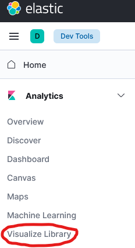
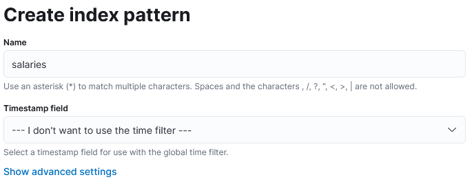
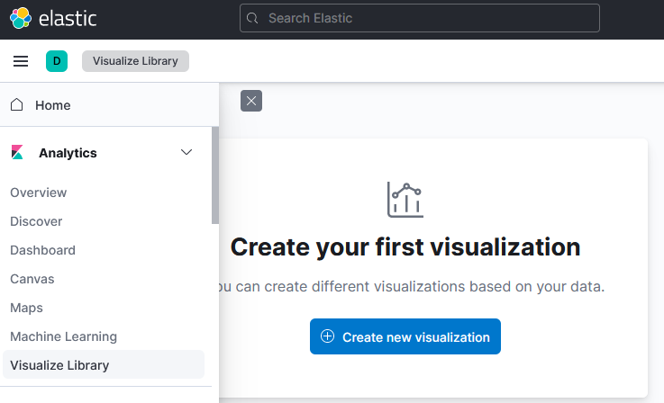
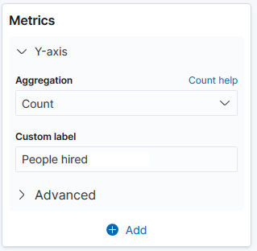
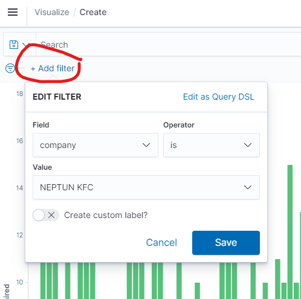
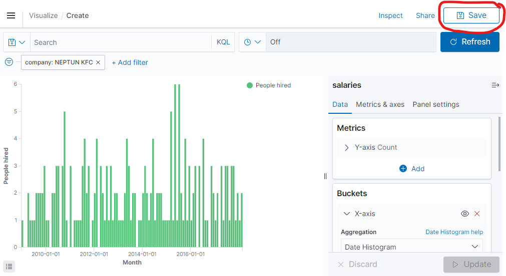
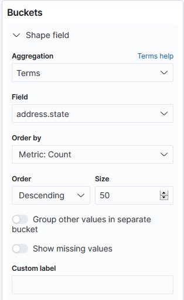

# Exercise 5: Kibana visualizations

The purpose of this exercise is to use the data visualization capabilities of _Kibana_.

!!! note "Screenshots"
    The following exercises will ask you to create visualizations, then export their Kibana description as JSON, and create a screenshot of the visualization itself. When creating the screenshot, make sure the **entire visualization with the legend** is visible.

## Create an Index pattern

Our first step is to tell _Kibana_ which indexes it should consider when creating the visualizations.

1. Click on the _Visualize_ tab on the left side menu.

    

    When opening this page the first time, you will be redirected to the _Management_ / _Index patterns_ configuration page to create a new _index pattern_.

1. Create a new index pattern. Enter the index name — `salaries` — as the index pattern. Make sure _Kibana_ says _Success! Your pattern matches 1 index_, and click _Next step_.

    

1. Select _I don't want to use the Time Filter_ as _Time Filter field name_ since we will not use this function during the exercises. Click on _Create index pattern_.

    

1. Now click on the _Visualize_ tab again to see the following.

    

## a) How many people did KFC hire each month? (vertical bar chart)

1. Click on the _Create new visualization_ button on the _Visualize_ tab, and select _Vertical Bar_.

    

1. Select the previously created `salaries` index pattern as the search source.

    

1. Under the _Metrics_ setting, set _People hired_ as the _Custom Label_. (Expand the _Y-axis_ label to get the configuration options.)

    

1. Under the _Buckets_ setting, click _Add_, then select _X-Axis_, and set the following.

    - _Aggregation_ should be _Date Histogram_
    - _Field_ should be `hired`
    - _Minimum interval_ should be _Month_
    - _Custom Label_ should be _Month_.

    

1. In the top left corner, click on the _Add a filter_ link and filter for company "KFC" (with the appropriate prefix): use the following settings to create the filter. Click on _Save_ to save the filter.

    

1. The configuration of the visualization is now ready. You see the preview of the visualization. Click on the _Save_ button in the top right corner to save the visualization as `5_a`.

    

    !!! example "SUBMISSION"
        Create a screenshot of the visualization preview and save it as `ex5-a.png`. Make sure that the filter, including your Neptun code, is visible on this screenshot.

        Click on the _Stack Management_ tab in the left side menu, and choose the _Saved Objects_ option. Select and export the visualization you just saved — no need to include related objects. Save the downloaded file as `ex5-a.ndjson`.

        

## b) Show the gender and age distribution of the workers! (pie chart)

1. Go back to the _Visualize_ tab. It will likely load the last visualization. Click on the tab button again to get back to the landing page of all visualizations.

1. Click on the _Create visualization_ button on the _Visualize_ tab, and select _Pie_.

1. Select the previously created `salaries` index pattern as the search source.

1. Under the _Buckets_ setting, click _Add_ and select _Split Slices_ and set a _Terms_ aggregation on the `gender` field. As _Custom Label_ set _Gender_.

    

1. Within the _Buckets_ configuration area, click on the _Add_ button again and select _Split Slices_ with a _Range_ aggregation on the `age` field with the following ranges. Also, add a custom label _Age_.

    

!!! example "SUBMISSION"
    Create a screenshot of the resulting visualization and save it as `ex5-b.png`. Use the previous method to save and export the visualization. Save the exported file as `ex5-b.ndjson`.

## c) Show the distribution of the workers' locations on a map!

1. Create a new visualization of type _Region Map_. Select the previously created `salaries` index pattern as the search source.

1. Under the _Buckets_ setting add a _Shape field_ with _Terms_ aggregation on the `address.state` field. Make sure to set the _Size_ value to at least 50.

    

1. Under _Options_ / _Layer Settings_ select _USA States_ as _Vector map_ and _FIPS 5-2 alpha code_ as _Join field_.

    

!!! example "SUBMISSION"
    Create a screenshot of the result and save it as `ex5-c.png`. Save and export the visualization. Save the exported file as `ex5-c.ndjson`.
