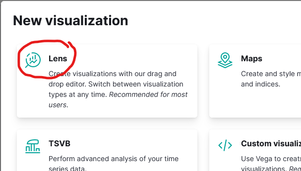
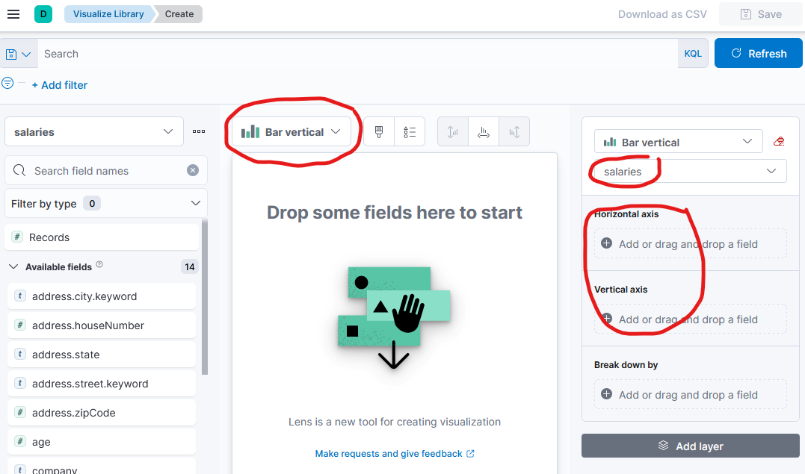
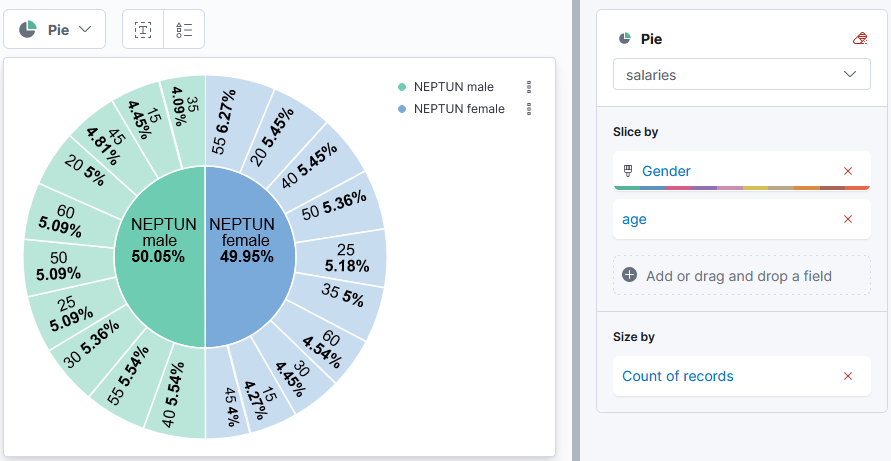
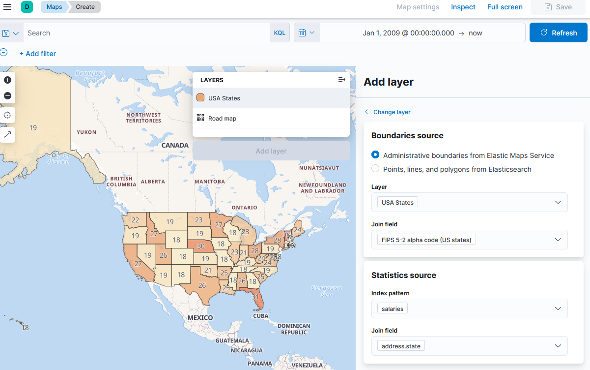

# Exercise 5: Kibana visualizations

The purpose of this exercise is to use the data visualization capabilities of _Kibana_.

!!! note "Screenshots"
    The following exercises will ask you to create visualizations, then export their Kibana description as JSON, and create a screenshot of the visualization itself. When creating the screenshot, make sure the **entire visualization with the legend** is visible.

## Create an Index pattern

Our first step is to tell _Kibana_ which indexes it should consider when creating the visualizations.

1. Click on the _Visualize Library_ tab on the left side menu.

    

    When opening this page the first time, you will be asked to configuration a new _index pattern_.

1. Click the _Create new index pattern_ button. Enter the index name — `salaries` — as the index pattern. Make sure _Kibana_ says _Success! Your pattern matches 1 index_, and click _Next step_.

    

1. Select _I don't want to use the time filter_ as _Timestamp field_ since we will not use this function during the exercises. Click on _Create index pattern_.

    

1. Now click on the _Visualize Library_ in the menu again to see the following.

    

## a) How many people did KFC hire each month? (vertical bar chart)

1. Click on the _Create new visualization_ button on the _Visualize_ tab, and use the _Lens_ visualization.

    

1. This will bring up an editor where the visualization can be built using drag and drop. Select the type in the middle and the content on the right side of the editor. Start by specifying the type as _Bar vertical_ and confirming the index on the right, which is `salaries`.

    

1. Set the _Horizontal axis_ to display a _Date histogram_ with the following settings:

    - _Field_ should be `hired`
    - _Minimum interval_ should be _month_
    - _Custom Label_ should be _Month_.

    

1. Then set the vertical axis to display the _Count_ of _Records_ with display name _People hired_.

    

1. The graph will be empty after these configuration because we need to select a time window too. In the upper right corner click into the time selector and display everything since Jan 1, 2009. (Click into the time field textbox to get the selector as below.) Then click _Update_ and the diagram should now display the bar chart.

    

1. The last thing that is missing is a filter. In the top left corner, click on the _Add a filter_ link and filter for company "KFC" (with the appropriate prefix): use the following settings to create the filter. Click on _Save_ to save the filter.

    

1. The configuration of the visualization is now ready. You see the preview of the visualization. Click on the _Save_ button in the top right corner to save the visualization with title `5_a` (without adding it to any dashboard).

    

    !!! example "SUBMISSION"
        Create a screenshot of the visualization preview and save it as `ex5-a.png`. Make sure that the filter, including your Neptun code, is visible on this screenshot.

        Click on the _Stack Management_ tab in the left side menu (at the very bottom), and choose the _Saved Objects_ option. Select and export the visualization you just saved — no need to include related objects. Save the downloaded file as `ex5-a.ndjson`.

        

## b) Show the gender and age distribution of the workers! (pie chart)

1. Go back to the _Visualize Library_ page and create a new visualization.

1. Select _Pie_ as the chart type.

1. First, add a _Slice by_ the _top values_ of the _gender_ field, then another slice by _intervals_ of the _age_ field. (The intervals should be large anough so that the final vizualization is similar to the one below.) And finally, the _Size by_ should be the count of records.

    

!!! example "SUBMISSION"
    Create a screenshot of the resulting visualization and save it as `ex5-b.png`. Use the previous method to save and export the visualization. Save the exported file as `ex5-b.ndjson`.

## c) Show the distribution of the workers' locations on a map!

1. Create a new visualization, this time, it should be a _Map_ type.

1. On the right add a new layer of type _Choropleth_ with the following settings>

    

!!! example "SUBMISSION"
    Create a screenshot of the result and save it as `ex5-c.png`. Save and export the visualization. Save the exported file as `ex5-c.ndjson`.
