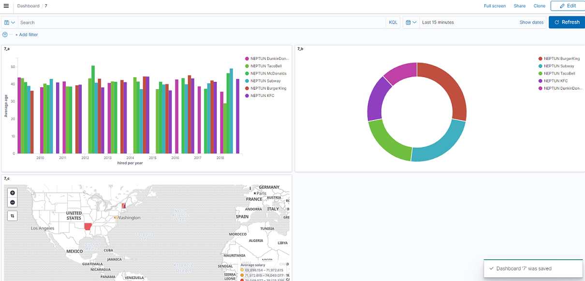

# Exercise 7: Kibana visualizations — practice

The purpose of this exercise is to practice the data visualization capabilities of _Kibana_. Feel free to take inspiration from the solutions in [exercise 5](exercise5.md).

## Create three visualizations to answer the following questions

**a)** What was the _average_ age of the people hired each year in the different companies?

Use a _vertical bar chart_ for visualization.

!!! tip ""
    - The horizontal axis is a date histogram per year of the _hired_ field.
    - The vertical axis is the average of the _age_.
    - And a further breakdown by company is needed. The breakdown should be the _top 10 values_ of the companies to get all of them.
    - Don't forget that a time filtering might be active in the upper right corner; set this to display everything since Jan 1, 2009.

**b)** What is the distribution of the workers between the various companies in the state of New York (NY)?

Use a _pie chart_ for visualization.

!!! tip ""
    - Make sure to set the _top values_ of the company to 10, otherwise not all companies are displayed.
    - Don't forget to add a filter for the state of NY too!

**c)** What is the _average_ salary of the workers aged between 18 and 30 in the various states?

Use a _Choropleth_ map visualization.

!!! tip ""
    - After specifying the map layer, you will need to edit the _join_ properties to use the average of the salaries. This setting will be available after the layer is added. Look for this setting on the right side of the screen where the map layer properties are set.
    - Don't forget that a filtering is needed too!

---

Your visualizations, when finished and added to the dashboard (next part of the exercise) should look similar to this:

## Create a dashboard

When all three visualizations are ready, create a new dashboard, and add the visualizations onto this dashboard.

1. Click on the _Dashboard_ item on the left side menu.

1. Create a new dashboard here.

1. Use the _Add from library_ button on the dashboard to add existing visualizations. Add the three you created in this exercise.

1. You can drag and drop them on the dashboard to various places, change their size, etc.

1. Save the dashboard (just like you saved each visualization).

!!! example "SUBMISSION"
    Create a screenshot of this dashboard and save it as `ex7.png`. The screenshot should show the entire dashboard with all three visualizations visible.

    Export the dashboard _ndjson_ file as `ex7.ndjson`, as done previously, but this time also **include related objects** (this is a setting in Kibana when exporting).
