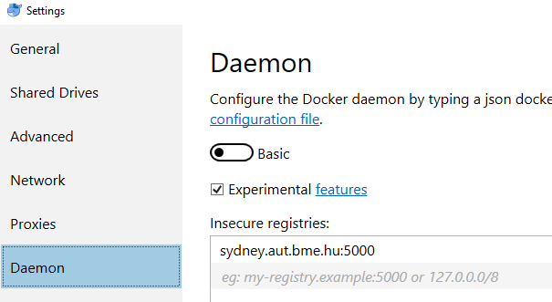

# Exercise 1: Preparation

## Preparing the system

1. Make sure you have started your machine in **with Hypervisor** mode.

1. After logging in, start the _Docker Desktop for Windows_ software. This will in turn start the _Docker_ service.

1. Right click on the _Docker_ icon in the _Notification Area_ (next to the clock in the _System Tray_), and make sure _Docker_ is set to use Linux containers. If it is not, click on the **Switch to Linux containers…** option in the context menu. Wait for the change to be done (the icon should stop animating).

1. Select the **Settings** option in the same context menu, and click on the **Daemon** tab. Make sure that the **Insecure registries** list contains the following entry: `sydney.aut.bme.hu:5000`. If it does not, add the entry and click **Apply**.

    

## Get the starter solution

1. Open the following URL: <https://classroom.github.com/a/Z5kgC1DA>

1. Log in with your GitHub account. If you do not have one, register one now.

1. Click the _Accept this assignment_ button.

1. Wait for the Git repository to initialize.

   > :information_source: Please note that your repository is private. No one has access to it, but you, and the teachers.

1. Check out the repository with your favourite tool. Work in the `c:\work\<neptun>` directory. If you do not have a favourite git tool, follow these steps:

   1. Create a folder where you will work, e.g. `c:\work\<neptun>\elasticsearch-lab`
   1. Open a console to this location
   1. Execute the following command: `git clone <repository-url> .`
      - In the university laboratories, this should ask for your credentials. If there is no login window, the clone will likely fail. Follow the instructions at the end of this page to remove existing GitHub credentials.

1. Open the checked out folder, and type your NEPTUN code into the `neptun.txt` file. We need this to map your submission to you.

   > :memo: Open `neptun.txt` and type your NEPTUN code in the file.

## Next exercise

Read the submission guide below, then proceed with the exercises.

Next is [exercise 2](exercise2.md).

## Submitting your solution

When you are finished, submit your solution by pushing the changes to the remote Git repository.

### Verify that you submit the necessary files

1. Check if `neptun.txt` contains your _NEPTUN_ code.
1. Execute `check-submission.ps1` with PowerShell to get basic feedback whether the required files are found.

### Commit and push your work

If you do not have a favourite git tool, execute the following commands in a console window in the same directory where your files are.

```bash
git add -A
git commit -m "Elasticsearch laboratory solutions"
git push
```

To verify that you have uploaded everything, open the repository online and check its contents.

### Remove GitHub credentials

In the university laboratories, the computer may remember your login information. To remove your credentials, follow these steps.

1. Open `Credential manager` from the Start menu.
1. Look for GitHub tokens in the `Windows Credentials` page, and remove all of them.

   