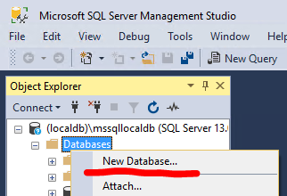

# Exercise 2: Create database and table for users data

1. Connect to the local database server using SQL Server Management Studio with the following credentials:

   - Server name: `(localdb)\mssqllocaldb`
     - If you are using the Express edition, the the connection string is `localhost\sqlexpress`
   - Authentication: _Windows Authentication_

   

1. Use _Object explorer_ to create a new database. **The name should be your NEPTUN code.**

   

1. Create a new table to store data from the users csv file. The columns of the table should copy the columns of the csv file with one exception: the "Location" column should be split into "City" and "Country".

   Click the _New query_ button and execute the following script to create the table.

   ```sql
   CREATE TABLE "BXUser" (
        "UserID" int,
        "Age" int,
        "City" nvarchar(1000),
        "Country" nvarchar(1000)
    )
   ```

## Next exercise

Next is [exercise 3](exercise3.md).
