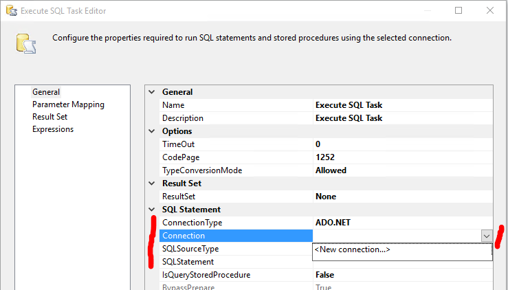
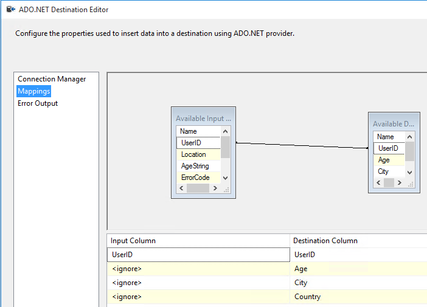
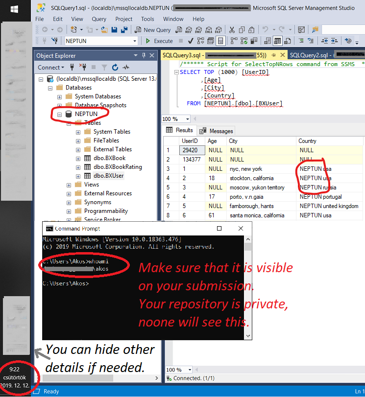

# Exercise 3: Import the users dataset using Integration Services

Extend the provided Integration Services project `ex3.sln` by modifying the project contents in place. You can find this solution in the root of the checked out git repository.

1. Open the solution with Visual Studio, then open `Package.dtsx` from _Solution explorer_.

   

1. Find the _SSIS Toolbox_; you will need to use this window in the following tasks.

   > If you cannot see this toolbox window, after opening `Package.dtsx`, look for the _Extensions > SSIS > SSIS Toolbox_ menu.

1. Add a new _SQL Task_ to the _Control flow_ that erases any content from the target database table. You will likely need to run the ETL process multiple times, but the data should only be imported once; hence the initial cleanup task.

   - Drag the _SQL Task_ from the toolbox.
   - Double click to open the details.
   - Specify the connection settings:
     - Use `ADO.NET` connection type.
     - Add a new connection using the dropdown. This will open a new dialog, where you need to click on the _New_ button again to add a new connection. Use the same connection settings (address and authentication) as before. When you configured the connection properties, make sure to press the _Test_ button to verify the settings.
   - Specify a `truncate table <tablename>` [sql statement](https://docs.microsoft.com/en-us/sql/t-sql/statements/truncate-table-transact-sql?view=sql-server-2017) to prune the table contents.

   

1. Add a new _Data flow_ element to the control flow pane. Give a meaningful name to this task: "import users". This task should follow the previous cleanup task: draw a line from the previous task box to this one to specify the ordering.

   Your control flow should like like the following at this moment.

   

1. Open the data flow element by double clicking it.

1. Drag a _Flat file source_ from the toolbox to the data flow pane. Double click to open in. Add a new _Flat file connection manager_ that specifies the source file and its details.

   - Browse the input file `BX-Users.csv` from your local disk.
   - Set the correct _Format_ for parsing

     - Format: Delimited
     - Text qualifier: specify " (double quotation mark)
     - Check "Column names in the first data row"

       

   - Switch to the _Columns_ page (within the dialog)
     - Verify that the _Row delimiter_ is `{CR}{LF}` and the _Column delimiter_ is semicolon.
   - Switch to the _Advanced_ page (within the dialog)
     - Verify that the correct number of columns is present
     - Change the UserID to be parsed as `four byte signed integer`
     - Although the age should be a number, it must be parsed as a string here, because there are values in the CSV with the literal `NULL` text
     - Increase the length (_OutputColumnWidth_) of the Location column from 50 to 1.000
   - The preview pane is a good way to verify the results. Make sure that there are no lingering quotation marks in the values (if there are, you missed to specify the text qualifier before).
   - Close the dialog. If you need to modify the settings, you will find this _Connection manager_ at the bottom of the designer surface.

     

1. In order to split the _Location_ column into two, and to parse the _Age_ as a number, add a _Derived column_ transformation (drag one from the SSIS Toolbox pane to the data flow editor surface). Connect the blue output of the file source to into this new box to specify the data flow direction (see image below for reference). Then open the settings of the _Derived column_ element to specify how the derived values are calculated.

   - Add a new column that contains the age as an integer. Check if the string is "NULL", in that case keep the null value, or cast to int.
     - Use the following expression: `[Age] == "NULL" ? NULL(DT_I4) : (DT_I4)[Age]`. (You may need to change the column names.)
   - Split the location column into two, and **include your Neptun code** in the text: create a new _City_ and a new _Country_ column using string operations; _Country_ should be prefixed with your neptun code.
     - Take a look at a few examples of the _Location_: they are in the form of "city, state, country"
     - To separate the country find the second comma in the text. The rest is the city (you can keep the state included in the city text). **Prefix the country with your Neptun code** by concatenating it as a string to the front. E.g. "nyc, new york, usa" becomes:
       - Country: "NEPTUN usa"
       - City: "nyc, new york"
   - Find more information on the syntax of the _Expression_ here: <https://docs.microsoft.com/en-us/sql/integration-services/expressions/integration-services-ssis-expressions?view=sql-server-2017)>

     

1. Remove duplicate records. Add a new _Sort_ transformation, then connect it to the output of the previous element. Open its settings: chose to sort on the _UserID_, and check the _Remove rows with duplicate sort values_ checkbox.

   

1. Add an _ADO NET Destination_ component (look in the _Other Destinations_ category) to save the data into database.

   - Direct the output of the previous _Sort_ component here.
   - Open the component settings dialog by double clicking the component box.
   - Use the connection manager created before.
   - Select the users table you created as target.

     

   - Check the mapping and make sure that the right fields go into the right columns. Make sure to double check the _Age_ column because it may exist as a number and as a string too; you need the numbered type here. (Mind, that the input column names may be different for you.)

     

1. If you were to execute the process now, it would fail due to errors in the _Derived columns_ transformation. Some content does not correspond to the transformations. Let us skip these rows.

   - Add another _ADO NET Destination_ component.
   - Point the red arrow from the _Derived column_ into this new database destination.

     

   - A the [Configure Error Output dialog](https://docs.microsoft.com/en-us/sql/integration-services/configure-an-error-output-in-a-data-flow-component) will pop up to specify how to handle errors. For all columns and error types select _Redirect row_. There is a total number of 6 elements to change here. Close this dialog.

     

   - Open the new _ADO NET Destination_ and specify its settings too.

     - Although the result of the transformations are not available, we still save the UserId value. The other database columns will not have any mapping. So effectively only the UserID will be saved to database.

     

1. Run the ETL process by using the _Start_ button on the toolbar of Visual Studio.

1. If the process succeeded, verify the **contents of the table** using SQL Server Management Studio. Verify that you **added your Neptun code prefix** to the Country names. Then create a screenshot of the table contents.

   Save the screenshot file as `ex3.png` - overwrite the placeholder file with yours.

   Please make sure that the screenshot is taken such that it

   - includes the database name (which is your Neptun code) from the _Object explorer_ window,
   - contains the date and time when the screenshot was taken (e.g. including the clock form the Start menu)
   - and includes the name of the machine you are working on (e.g. execute a `whoami` command from the command prompt).

   

## Next exercise

Next is [exercise 4](exercise4.md).
