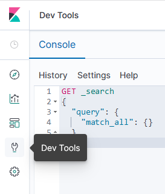
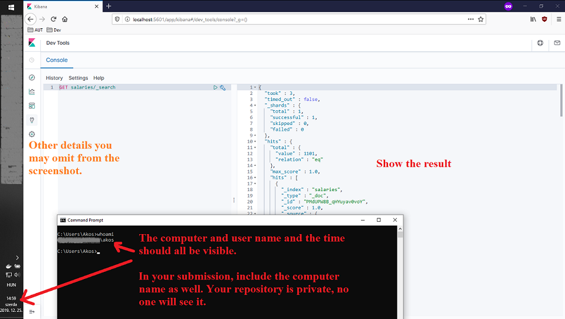

# Exercise 3: Initializing _Elasticsearch_

Now that both _Elasticsearch_ and _Kibana_ are operational, let us create the necessary indices for us to work with in the following exercises.

## Index a document via _PowerShell_

First, we are going to use _Elasticsearch's_ REST API through _PowerShell_.

1. To index a document in _Elasticsearch_ issue the following command.

   ```powershell
   (curl 'http://localhost:9200/test/_doc/1?pretty' -Method Put -ContentType 'application/json' -Body '{ "name": "John Doe" }' -UseBasicParsing).Content
   ```

   This way we inserted a document of type `_doc` into the index called `test` with id `1`. The response JSON should state `"result": "created"`.

1. Query the document with the following command.

   ```powershell
   (curl 'http://localhost:9200/test/_doc/1?pretty' -Method Get -UseBasicParsing).Content
   ```

   The result JSON tells us the name of the index, the id of the document, as well as the full document we inserted in the `_source` field.

   ```json
   {
     "_index": "test",
     "_type": "_doc",
     "_id": "1",
     "_version": 1,
     "_seq_no": 0,
     "_primary_term": 1,
     "found": true,
     "_source": {
       "name": "John Doe"
     }
   }
   ```

## Create an index and index many documents using the _bulk_ API

In this part of the exercise we are going to create an index for documents containing information about people working in the fast food industry. Here is a sample document.

### Sample document

```json
{
  "gender": "female",
  "firstName": "Evelyn",
  "lastName": "Petersen",
  "age": 17,
  "phone": "+1 (900) 503-3892",
  "address": {
    "zipCode": 63775,
    "state": "NY",
    "city": "Lynn",
    "street": "Clarkson Avenue",
    "houseNumber": 503
  },
  "salary": 87217,
  "company": "Subway",
  "email": "evelyn.petersen@subway.com",
  "hired": "09/29/2009"
}
```

We are going to use _Kibana's_ Dev Tools for this part of the exercise. Although it uses the same REST API that we used through _PowerShell_, it provides a more convenient GUI for us to use. In this _Dev tool_ we can run queries. A query contains of (1) a http verb and an URL matching Elasticsearch' REST API, and then (2) a body as JSON.



1. In _Kibana's_ Dev Tools enter `PUT salaries` in the first line and then enter the following JSON starting on a new line. Then press the _Play_ button in the top left corner of the editor.

   ```json
   {
     "settings": {
       "number_of_shards": 1,
       "number_of_replicas": 0
     },
     "mappings": {
       "properties": {
         "gender": { "type": "keyword" },
         "address.state": { "type": "keyword" },
         "company": { "type": "keyword" },
         "hired": {
           "type": "date",
           "format": "MM/dd/yyyy"
         }
       }
     }
   }
   ```

   

   The settings we use here are the following.

   - `settings`: We set the number of _shards_ and _replicas_ here. While settings the number of _shards_ is not that important here, we must set the number of _replicas_ to **zero** in order to have an index with **green** _health_ value. This is because _Elasticsearch_ refuses to put a _shard_ and its _replica_ on the same node, and we only have a single node.

   - `mapping`: Mapping is the "schema" of the data. It is not necessary to set this, but when the data is ambiguous, Elasticsearch will make a choice how to interpret data, unless we specify the mapping.

     - `gender`, `address.state`, `company`: These are values we know are only going to have a few select values (e.g. "male" and "female" for gender), therefore we do not want to allow _free text search_ on them. We can help the system by specifying this.

     - `hired`: Although this is a date field, the date representation of our data is not standard — _Elasticsearch_ wouldn't recognize it by itself. Therefore we have to explicitly specify the date format.

1. We can check the indices with the `GET _cat/indices?v` query.

   

   > Note how the health of the `test` index is **yellow** and the health of the `salaries` index is **green**. That is because the default value for the number of _replicas_ is **1**.

1. Insert the sample document into the created index. You can find the sample document [here](#sample-document).

   ```
   POST salaries/_doc
   {
     ... // the sample document comes here
   }
   ```

   

   We can use the `_id` value in the response to query the document.

   ```
   GET salaries/_doc/eZSmaGkBig5GeeBFsFG6
   ```

1. Add multiple documents to the index using the _bulk_ API. Issue the following command from the _PowerShell_ window in the folder of the starter solution.

   ```powershell
   curl 'http://localhost:9200/_bulk' -Method Post -ContentType 'application/json' -InFile .\salaries.json -UseBasicParsing
   ```

1. Execute a search using query `GET salaries/_search`. This will return a few documents, and also let us know how many documents there are (total number matching the query will be the total number of documents, due to the lack of filtering in this search). There should be **1101** documents.

   

1. Create a screenshot of the result as follows.

   Save the screenshot file as `ex3.png` - overwrite the placeholder file with yours.

   Please make sure that the screenshot is taken such that it

   - includes the entire browser window and especially the result,
   - contains the date and time when the screenshot was taken (e.g. including the clock form the taskbar)
   - and includes the name of the machine you are working on (e.g. execute a `whoami` command from the command prompt).

   

## Next exercise

Next is [exercise 4](exercise4.md).
