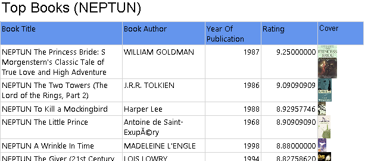

# Exercise 6: Create a report listing the highest rated books

Create a report that lists the **top 10 highest rated books** in a table.

> The report should be edited in solution `exercise-6\ex6_reporting_services.sln` in file `books.rdl`.

- The list should be in a table format displaying the title, author, publication year, average rating, and the cover image of the book (using the medium sized image URL from the dataset).

  - Use an _Image_ component from the toolbox. The image source should be _External_ in order to fetch it based on the URL.

- The average rating should be computed by an SQL script. Ignore any book that does not have at least 20 ratings.

  > Include this sql script (a single sql statement) in file `exercise-6\ex6_sql_get_top_books.sql`.

- Make sure to calculate the rating appropriately: if the imported rating is of type integer, make sure to use decimal types when averaging the values!

- Add a title to the report, and include your neptun code in the title.

The final report should look similar to this:

> Include a screenshot of the report from Visual Studio as `exercise-6\ex6_report_screenshot_books.png`.

## Submit your solution

See instructions in [exercise 1](exercise1.md) to submit your solution.
