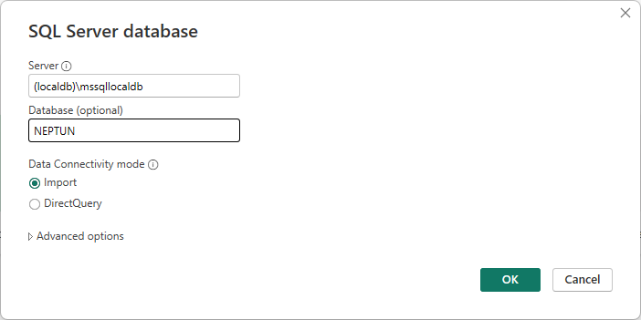
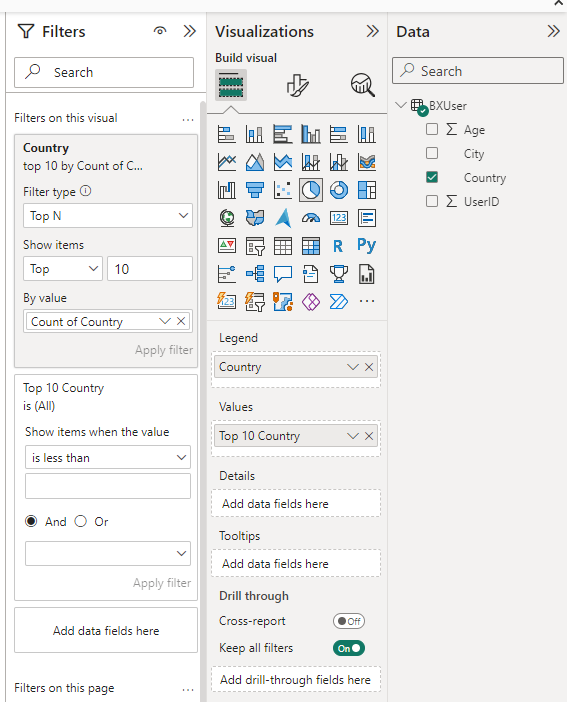

# Exercise 4: Report about users

Create a report that summarizes from which country do our users come from. A table should list the number of users by country, along with the average age from the country, and a pie chart should display the number of users from the top 10 countries.

The final report should look similar to this:

1. Open the project _ex4.pbix_ in the repository with PowerBI Desktop.

1. Add a new data source using the _Get data_ and _SQL Server_ options. PIC

    - Use the same settings for _Server_ and _Database_ as before.

    

    - Load the table BXUser.

    

1. After the data is loaded, open the Report View and add a Table from _Visualizations_ tab.

    - From the _Data_ tab, drag the following columns of _BXUser_ to Columns: _Country_, _UserId_, _Age_ 

    - For the _Age_ columns, select _Average_ instead of _Sum_ using the dropdown menu.

    

    - Sort the table by clicking on the _Count of UserId_ column in the report.

1. Add a Pie Chart from the _Visualizations_ tab.
    
    - Drag the column _Country_ to _Legend_ and _Values_ of the chart.

    - Add a _Top N_ filter to show only the top 10 countries.

    - Rename the diagram by renaming the _Values_ field.

    

1. Add a title to the report, and **include your Neptun code in the title**. Make sure the report looks similar to the sample report on the top of the page. (Colors can be different.)

1. Save your project.

!!! example "SUBMISSION"
    Include a screenshot of the report as `ex4.png`.

    Please make sure to create the screenshot such that relevant parts of the report are all visible (title, table, and diagram too) and that the title contains your Neptun code. See the sample at the beginning of the exercise.
