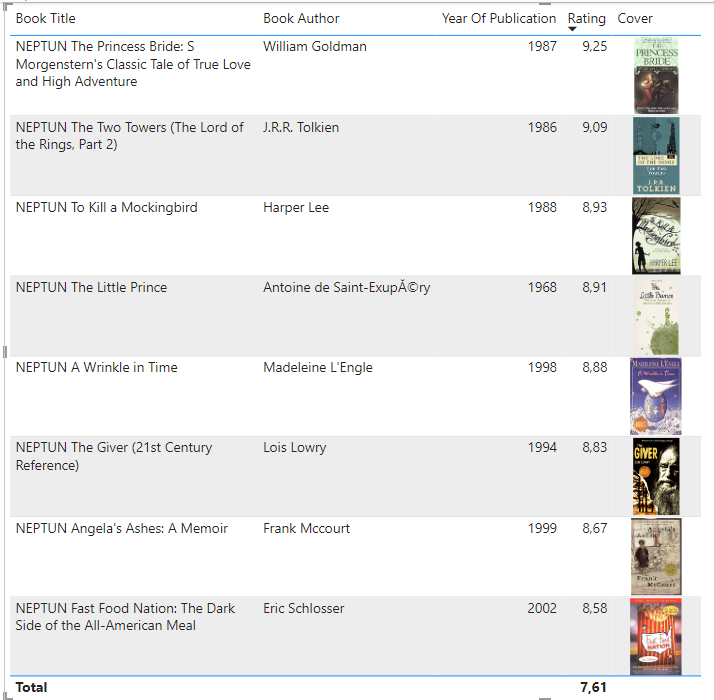

# Exercise 6: Create a report listing the highest rated books

In this exercise, you are required to create a new report using PowerBI Desktop. 
Create a report that lists the **highest rated books** in a table.

- The report should be edited by opening __ex6.pbix_.

- The top rated books should be presented as a table displaying the title, author, publication year, average rating, and the cover image of the book (using the medium-sized image URL from the dataset).

- Create a connection between the tables _BXBook_ and _BXRating_ by using the Model View on the left pane.

- Using the Table View, change type of the URL columns to _Image URL_. (Select the column and use the _Column Tools_ menu.)

- Only show books with at least 20 ratings. (Use filters!)

- Make sure to calculate the average rating appropriately.

- Add a title to the report, and include your Neptun code in the title.

- The final report should look similar to this (your results do not need to match exactly):

     

!!! example "SUBMISSION"
    A screenshot of the **report** in file `ex6.png`.

    Please ensure that the screenshot displays all the relevant parts of the report (title, table with Neptun codes, ratings, cover images). See the sample above.
