# Exercise 3: Creating a transformation

We will be using the files containing the results of previous final exams, to create new information. This information will be used for decision making, statistics, etc. In the first task, we will create a transformation, which takes the files, parses them, creates yearly and other statistics.

1. If you have started the Pentaho Data Integration correctly, the following screen will appear:

    

1. Create a new transformation, by choosing File -> New -> Transformation. Save this file named `ex3-transformation1.ktr`, in the
working directory.

1. Using the search bar on the left panel, place a _Get file names_ node on the screen.

    

1. Double click on the placed node to open the context menu:

    

    - In the panel above the table, we can define a file or folder to use. When done, pressing the Add button will put it in the table.
    - The browse button opens a file picker, if you want to pick a directory, you first choose a file, then delete the last part of the path manually. Choose C:\Pentaho\data\ZV\
    - Use the regular expresion input, to limit the search for csv files. Use the following pattern: .*csv To make sure you have correctly set up the node, press the Preview Rows button, you should see something like this

    

1. Place a _CSV File input_ node on the transformation. To connect it with our Get File Names node, hover over the former and select the rightmost box.

    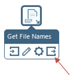

    The connection should look like this:

    

    !!! warning "Be careful!"
        If you click on the arrow, it will turn grey, indicating the connection is disabled! You should never see this:

    

1. Double click on the “CSV File Input” node and set the following:

    - The filename field -> filename
    - Include filename field -> check (we will use it to parse the date)
    - Delimiter -> ;
    - Enclosure -> delete the content
    - Lazy conversion -> uncheck
    - Add the columns from the file (Identifier - Integer, Neptun code - String, Exam score - Integer, Application score - Integer, Grade - Number)

    

    Running the whole transformation now (by pressing the play button), should lead to both our nodes finishing successfully. When clicking on the _Preview data_ tab on the bottom, we should see the following:

    

1. We want to include the date of the exam for each data entry. To do this we have to parse this information from the filename field. The first step is to cut the string to the necessary length, by using a String cut node. Place it and connect it to the _CSV File input_. Double clicking on it should bring up the following screen:

    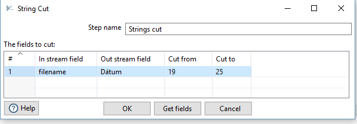

    - Set the _In stream field_ to filename,
    - Set the _Out stream field_ to Date, this will make the node put its output (the cut stirng) in a new field.
    - Set the _Cut from_ and _Cut to_, to cut the filename from the absolute path (19 and 25 if you use C:\Pentaho as the working directory)

1. Place a _Replace in string_ node and connect it to the previous node. Double click and set it up to replace the _ (underscore) with a / (slash) in the field Date:

    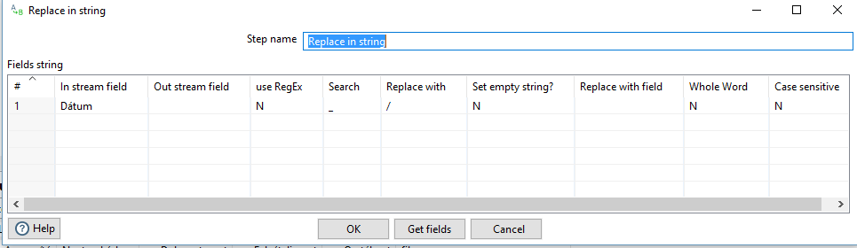

    The transformation looks like the following now:

    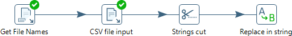

    If everything was done correctly, you should see the following output in the Preview data.

    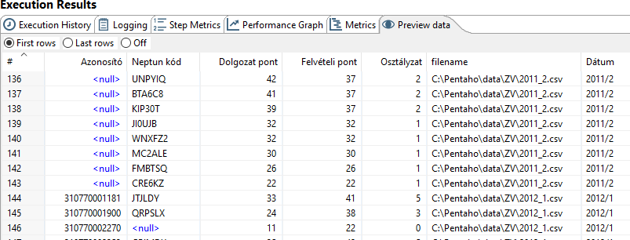

1. Place a _Filter rows_ node, we will use this to filter out the rows where the Grade (Osztályzat) is invalid. The Filter node has a hierarchical Boolean expression builder. Set it up as the following:

    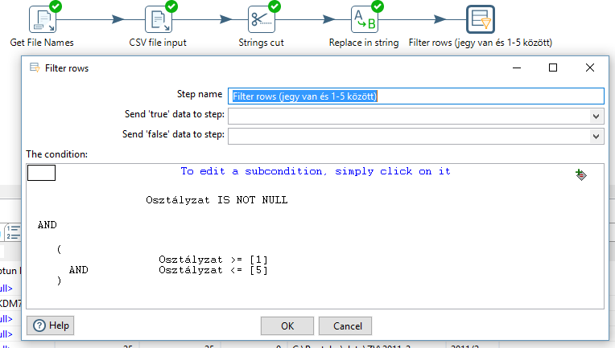

1. Place a _Data validator_ node. We will use this to validate the proper formatting of the Neptun code. In order to do this, double click on the node, and add a new validation rule by clicking on the New validation button.

    

    - Check the _Report all errors, not only the first_
    - Select Neptun code in the _Name of the field to validate_
    - Put this regular expression in the _Regular expression expected to match_ cell: [A-Z0-9]{6}

    After running the transformation, we should see that our validator has found an error:

    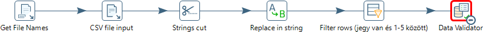

1. To proceed, we have to handle this error. The easiest way to do this, is to append a _Text file output_ node to the _Error handling of the step_ output of the _Data Validator_.

    

    In the _Text File Output_, we define an output file, for example C:\Pentaho\result\invalid_neptun.txt

    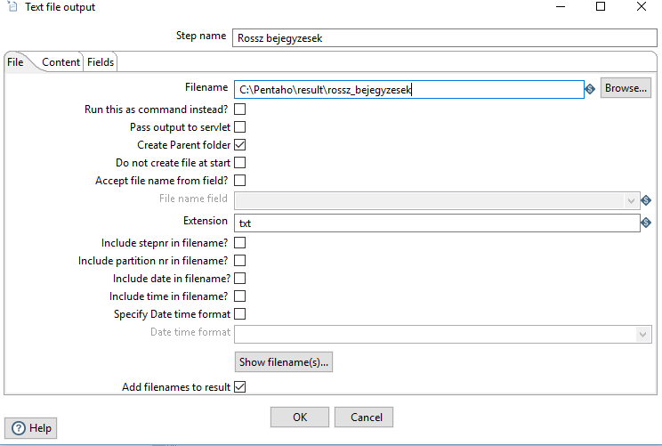

    If done correctly, the transformation should no longer fail, and the output file should contain the invalid rows:

    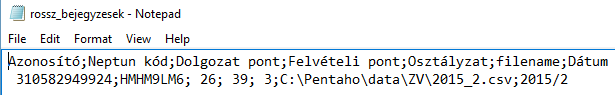

1. Next, we place a _Sort Rows_ node. This will be used to presort the data for our _Group by_ node, which only works on data sorted by the grouping key. After placing and connecting the node, set the _Fieldname_ to Date, and leave the other cells on default values. 

    !!! warning "IMPORTANT"
        If Pentaho asks whether to copy or distribute the data as the output of this step choose copy.

    

1. Place a _Group By_ node and connect it to the _Sort Rows_ node.

    

    Set it up as the following:

    - Group field (the key which will be used to create the groups): Date
    - Aggregates (the functions ran on the groups)
        - _Name_: Number of students, _Subject_: -, _Type_: Number of rows (without field argument)
        - _Name_: Average grade, _Subject_: Grade, _Type_: Average (Mean)

    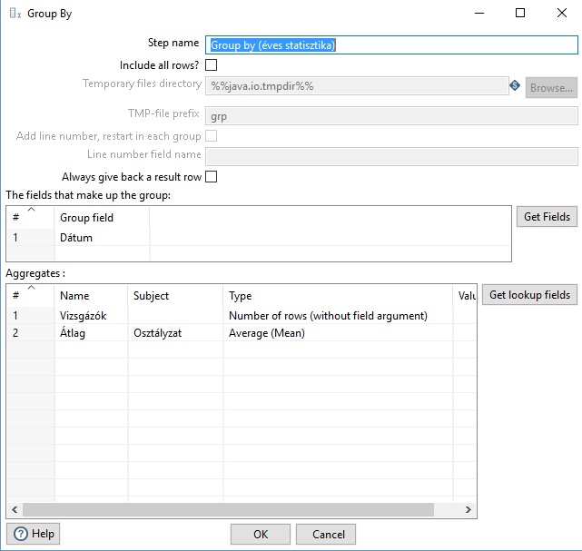

    If everything is working correctly, you should see the aggregated results at the Preview data tab of the Group by.

1. In this next part, we will be creating a report on those students, who took the final exam more than once. For this, we will be creating a new path in the transformation. Place a _Filter rows_ node after our previously placed _Data Validator_. This filter will filter out those rows, which doesn’t contain a Neptun code. This is necessary, because Neptun is the only way to identify a student between multiple exams. The node is configured as follows:

    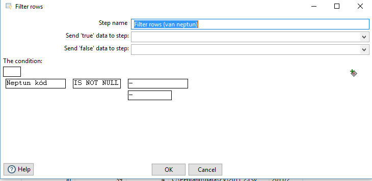

1. Next we place a _Sort rows_ node, which will presort the date for our uniqueness checker (in much the same way as for the _Group by_). Configure this sorting step as the following:

    !!! note ""
        Write your NEPTUN code after the step name!

    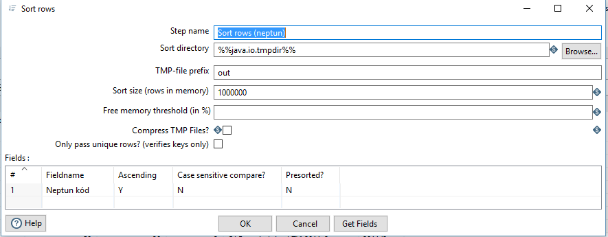

1. Place a _Unique rows_ node after the sort and set it up as the following (note that _Redirect duplicate row_ is checked).

    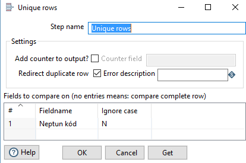

1. Finally place a _Microsoft Excel Output_ at the Error handling of the _Unique rows_. This will place the duplicate rows (students who took more than one final exam) in this Excel sheet. Set it up to save the file C:\Pentaho\result\multiple_exams.xls

    

    The final transformation should look like this:

    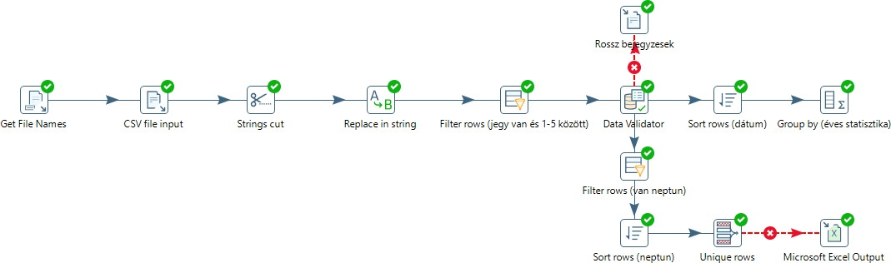

!!! warning "Warning!"
    Note, that opening the file will cause Excel to lock it, therefore any subsequent runs will fail, while the file is open!

!!! example "SUBMISSION"
    Save the final transformation as `ex3-transformation1.ktr`

    Create a screenshot of the executed transformation flow and save it as `ex3-transformation1-flow.png`. Make sure that all the nodes including your Neptun code are visible on this screenshot.