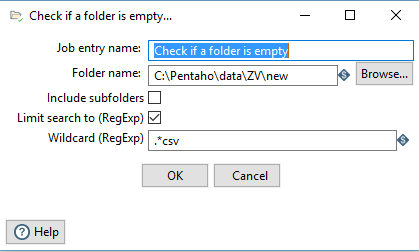
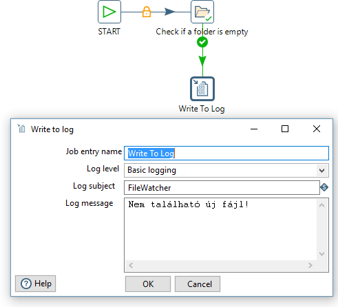
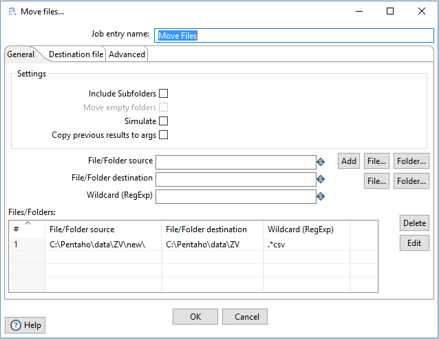

# Exercise 4: Creating a job to run a transformation

While a Pentaho transformation decides how data should be extracted, transformed and loaded, the timing and preconditions of these operations (e.g. when it should run) can be defined in a Pentaho job. This job we create, will be watching the folder C:\Pentaho\data\ZV\new for new incoming csv files (containing final exam data). If such a file is received, it will move the file to the others and run the transformation we defined in the previous task.

1. Create a new job in the Data Integration tool. Click on the File -> New -> Job menu. Save it named `ex4-job1.kjb`.

1. Place a Start node, this will be the entry point of our Job.

1. Place a Check if a folder is empty node and connect the start node to it.

    

    Notice, that the arrow indicating the connection has a padlock on it. This means that it is an unconditional hop, meaning that this state transition will fire regardless of the outcome of the initiating step. There are two other types of connection in case of a job: positive (true) and negative (false), each triggering on the corresponding outcome. You can switch the connection types by clicking on the arrow. 
The _Check if a folder_ is empty node should check for .csv files in the target directory (C:\Pentaho\data\ZV\new). To do this, set it up as the following:

    

1. We must handle both possible outcomes of the _Check if a folder is empty_ node. In case it is empty, we do not have to do any transformation, we simply log the outcome. To do this, place a _Write to log_ node and set it up as the following:

    - Set the log level to Basic Logging
    - Set the log subject to FileWathcer
    - Set the message to “No new file found!”

    !!! note ""
        Write your NEPTUN code after the Job entry name!  

    

1. To handle the case when there is a file to move (_Check if a folder is empty_ returns false) we place a _Move files_ node.

    

    - Set the folder source to C:\Pentaho\data\ZV\new
    - Set the folder destination to C:\Pentaho\data\ZV
    - Set the wildcard to .*csv

    

1. Place a _Transformation_ block, which we will use to call our previously created transformation. Browse and select the transformation file (`ex3-transformation1.ktr`).

    

1. Place a _Success_ block and connect both the log writing step and the _Transformation_ step to it. Your job should look like this:

    

    Move one of the .csv files to the new folder and run the job! You should see it moved to the others and the output files of the transformation created.

!!! example "SUBMISSION"
    Save the final job as `ex4-job1.ktr`

    Create a screenshot of the executed job flow and save it as `ex4-job1-flow.png`. Make sure that all the nodes including your Neptun code are visible on this screenshot.