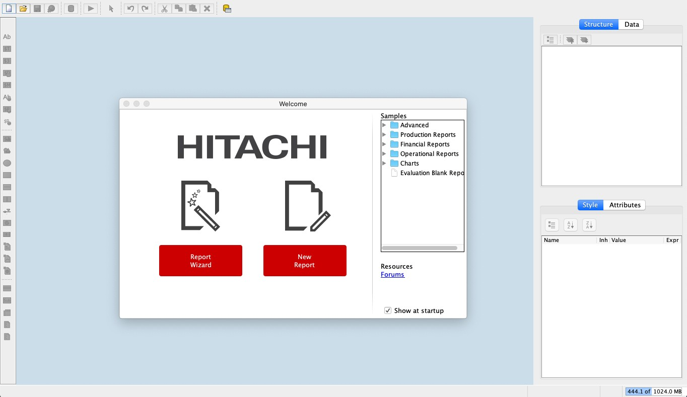
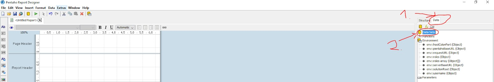
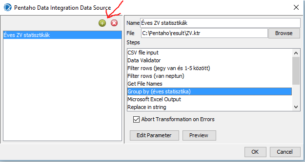
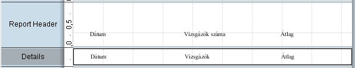
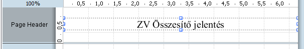
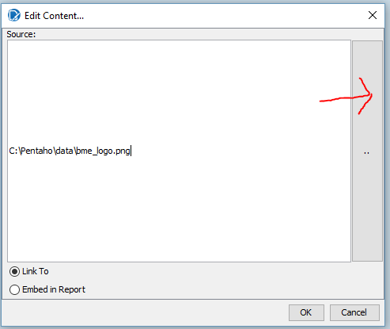
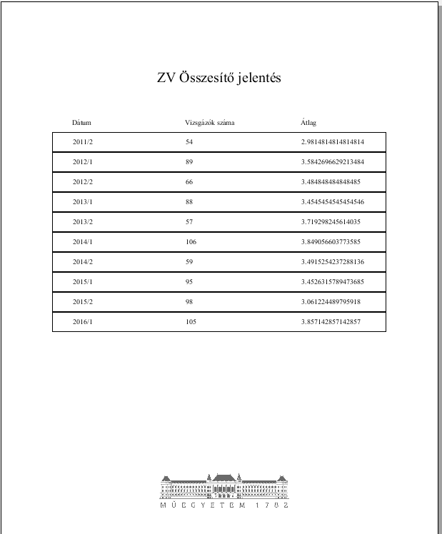
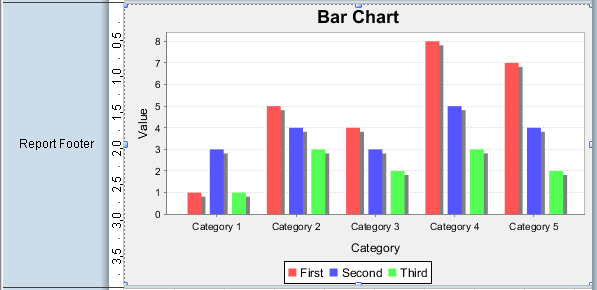

# Exercise 5: Creating a report

In this task, we will be creating a new Report based on the previously calculated statistics

1. Start the Report Designer app, by running the report-designer.bat file in the downloaded folder. If done
correctly, the following screen will appear. Choose new report and save it name `ex5-report1.prpt`.

    

1. Click on the Data tab and right click on the Data Sets and choose Pentaho Data Integration from the list.

    
    

1. Click on the plus button and browse for the previously created transformation, named `ex4-transformation1`.ktr. After choosing it you should see the previously declared steps, choose the Group by from here.

    

1. Take a look at the structure of the report, you should see the following sections:
    - Page header/footer: header/gooter repeated for every physical page of the report
    - Report header/footer: header/footer present at the start of the actual report (a report template could contain multiple records)
    - Details: repeated for every entry (row) in the data set
    Drag and drop the date, Number of students, and Average grade to the details section, in the following pattern.

    

1. Select the Details section in the Structure window. Using the Style panel on the bottom right, give the Details section a solid border of 1 px.

    

1. Place 3 labels above each column, containing their names. Your report should look like this:

    

1. Place a label on the page header, fill it with the “Final exam report NEPTUN” text 

    !!! note ""
        Write your NEPTUN code after the title!

    

1. Place the logo of the University in the page footer.

    

    If you click on the play button, and select print preview, you should see the following:

    

1. Place a bar chart in the Report Footer section (so it will not repeat for each row in the data set).

    

    Double click on it and set the category column to the Date and the Value column to Average.

    

    Running the report again should yield the following (if you don’t see it, make sure it’s not on the next page, you can navigate with the >> arrows)

!!! example "SUBMISSION"
    Save this file as `ex5-report1.prpt`

    Create a screenshot of the report and save it as `ex5-report1.png`. Make sure that the title, including your Neptun code, the table and the bar chart is visible on this screenshot.