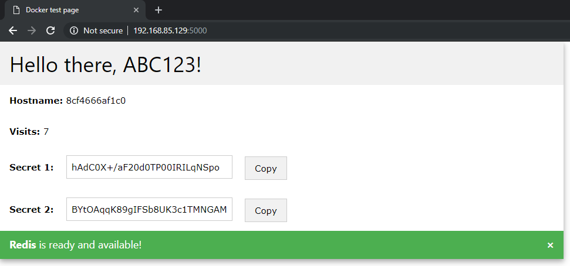

# Exercise 3: Defining and running multi-container _Docker_ applications

The purpose of this exercise to use the `docker-compose` tool to define and run an application consisting of the previous _Python_ web application and a _Redis_ database.

1. Create a `docker-compose.yml` file next to the `Dockerfile` created in the previous exercise. The file's contents should be the following.

    ```yml
    version: '3' # Version of the docker-compose.yml file, the tool tries to parse it differently depending on this value

    services:               # List the services our application consists of
      bilab_redis:          # The Redis service
        image: sydney.aut.bme.hu:5000/redis:5.0.3-alpine    # The Docker image to use for the service
        networks:
          - bilab_network   # Connect it to the network we created
      bilab_web:            # The Python webapp we've seen before
        build: .            # The image's Dockerfile is in the current folder
        ports:
          - 5000:5000       # Port mapping host -> container
        depends_on:
          - bilab_redis     # The tool should start the Redis service first
        networks:
          - bilab_network   # Connect it to the network we created

    networks:               # We can create a new private network for our application
      bilab_network:
        driver: bridge
    ```

1. We can start the application using the following command in the previously opened _PowerShell_ window.

    ```powershell
    docker-compose up -d --build
    ```

1. We can list the running containers using the following command.

    ```powershell
    docker ps
    ```

    

1. Open `localhost:5000` in the browser. You might have to use `CTRL-F5` to bypass the browser's cache to see the new content.

    

    Refresh the page a few times to see the _Visits_ number change, and to gain access to _Secret 2_.

    > :memo: If everything is working, save the `docker-compose.yml` in `exercise-3\docker-compose.yml` and copy the _Secret 2_ value in `exercise-3\secret.txt`.

1. To stop and remove the application's containers and the private network, you have to issue the following command.

    ```powershell
    docker-compose down
    ```

## Next exercise

Next is [exercise 4](exercise4.md).