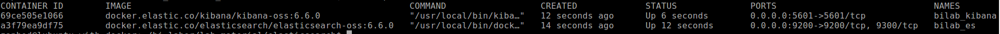
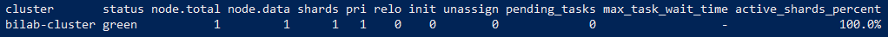
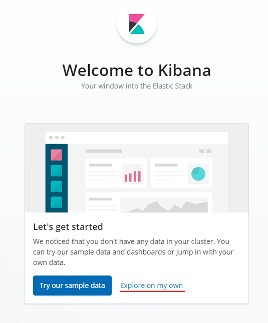
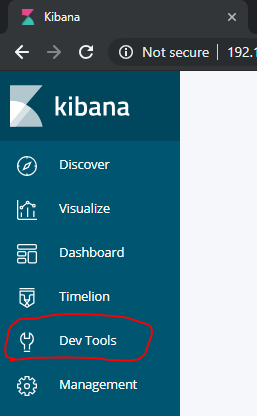
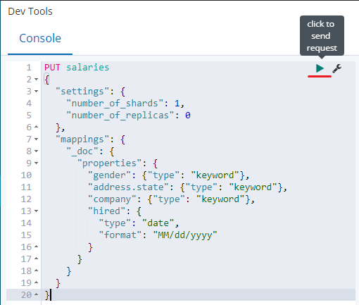
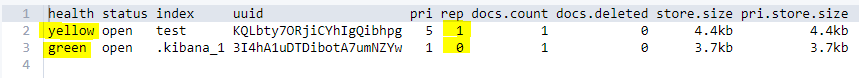

# Exercise 4: Initializing _Elasticsearch_

> :memo: Locate the provided files in the `data\elasticsearch` folder. This contains a `docker-compose.yml` file and some test data that we are going to use in the following exercises.

The purpose of this exercise is to start _Elasticsearch_ and _Kibana_ and to create the necessary indices for us to work with in the following exercises.

## Start the _Elasticsearch_ and _Kibana_ services

1. Open the `docker-compose.yml` file in a text editor of your choice and check its contents. The basic layout of the file is similar to what we created in the previous exercise. It has, however, some important additions.

    * `environment`: This is used to set environment variables in the container. We can use these to provide some settings for _Elasticsearch_ and _Kibana_ as well. One example is the `cluster.name` variable.

    * `ulimits`: In order for _Elasticsearch_ to function properly, we have to set some `ulimit` values in the container.

    * `volumes`: Due to how file storage works in _Docker_ containers, every data is lost if we remove a container and start a new one. Of course, this is not exactly appropriate for a database service like _Elasticsearch_. Therefore we are going to use a `volume` which provides a more durable storage option.

1. Navigate a _PowerShell_ window into the folder with the `docker-compose.yml` file, and issue the following command.

    ```powershell
    docker-compose up -d
    ```

    We can check the running containers the way we did before, using `docker ps`.

    

1. We can also check the state of the cluster using _Elasticsearch's_ REST API.

    ```powershell
    (curl 'http://localhost:9200/_cat/health?v&pretty' -Method Get).Content
    ```

    

1. Open a browser of your choice (_Kibana_ used to prefer _Chrome_, but you are free to experiment with others) and navigate to `localhost:5601`. You should see _Kibana's_ starting page.

    


## Index a document via _PowerShell_

First, we are going to use _Elasticsearch's_ REST API through _PowerShell_.

1. To index a document in _Elasticsearch_ issue the following command.

    ```powershell
    (curl 'http://localhost:9200/test/_doc/1?pretty' -Method Put -ContentType 'application/json' -Body '{ "name": "John Doe" }').Content
    ```

    This way we inserted a document of type `_doc` into the index called `test` with id `1`. The response JSON should state `"result": "created"`.

1. Query the document with the following command.

    ```powershell
    (curl 'http://localhost:9200/test/_doc/1?pretty' -Method Get).Content
    ```

    The result JSON tells us the name of the index, the id of the document, as well as the full document we inserted in the `_source` field.

    ```json
    {
      "_index" : "test",
      "_type" : "_doc",
      "_id" : "1",
      "_version" : 1,
      "_seq_no" : 0,
      "_primary_term" : 1,
      "found" : true,
      "_source" : {
        "name" : "John Doe"
      }
    }
    ```

## Crate an index and index many documents using the _bulk_ API

In this part of the exercise we are going to create an index for documents containing information about people working in the fast food industry. Here is a sample document.

### Sample document

```json
{
  "gender": "female",
  "firstName": "Evelyn",
  "lastName": "Petersen",
  "age": 17,
  "phone": "+1 (900) 503-3892",
  "address": {
    "zipCode": 63775,
    "state": "NY",
    "city": "Lynn",
    "street": "Clarkson Avenue",
    "houseNumber": 503
  },
  "salary": 87217,
  "company": "Subway",
  "email": "evelyn.petersen@subway.com",
  "hired": "09/29/2009"
}
```

> :information_source: We are going to use _Kibana's_ Dev Tools for this part of the exercise. Although it uses the same REST API that we used through _PowerShell_, it provides a much more convenient GUI for us to use.



1. In _Kibana's_ Dev Tools enter `PUT salaries` and then enter the following JSON starting on a new line, and then press the _Play_ button in the top left corner of the editor.

    ```json
    {
      "settings": {
        "number_of_shards": 1,
        "number_of_replicas": 0
      },
      "mappings": {
        "_doc": {
          "properties": {
            "gender": {"type": "keyword"},
            "address.state": {"type": "keyword"},
            "company": {"type": "keyword"},
            "hired": {
              "type": "date",
              "format": "MM/dd/yyyy"
            }
          }
        }
      }
    }
    ```

    

    The settings we use here are the following.

    * `settings`: We set the number of _shards_ and _replicas_ here. While settings the number of _shards_ is not that important here, we must set the number of _replicas_ to **zero** in order to have an index with **green** _health_ value. This is because _Elasticsearch_ refuses to put a _shard_ and its _replica_ on the same node, and we only have a single node.

    * `mapping`

      * `gender`, `address.state`, `company`: These are values we know are only going to have a few select values (e.g. "male" and "female" for gender), therefore we do not want to allow _free text search_ on them. We can help the system by specifying this.

      * `hired`: Although this is a date field, the date representation of our data is not standard — _Elasticsearch_ wouldn't recognize it by itself. Therefore we have to explicitly specify the date format.

1. We can check the indices with the `GET _cat/indices?v` query.

    

    > :information_source: Note how the health of the `test` index is **yellow** and the health of the `salaries` index is **green**. That is because the default value for the number of _replicas_ is **1**.

1. Insert the sample document into the created index. You can find the sample document [here](#sample-document).

    ```
    POST salaries/_doc
    {
      ... // the sample document comes here 
    }
    ```

    

    We can use the `_id` value in the response to query the document.

    ```
    GET salaries/_doc/eZSmaGkBig5GeeBFsFG6
    ```

1. Add multiple documents to the index using the _bulk_ API. Issue the following command from the _PowerShell_ window.

    ```powershell
    curl 'http://localhost:9200/_bulk' -Method Post -ContentType 'application/json' -InFile .\salaries.json
    ```

    Check the indices again with `GET _cat/indices?v` query. You should see **1101* documents in the `salaries` index.

    

## Next exercise

Next is [exercise 5](exercise5.md).