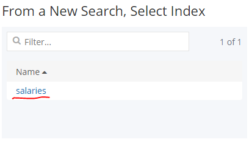
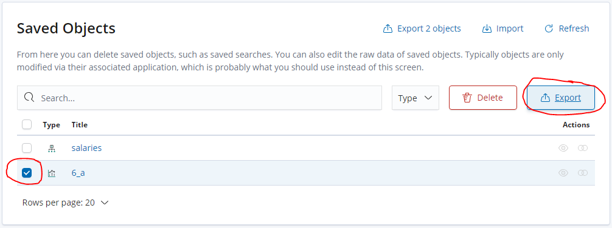
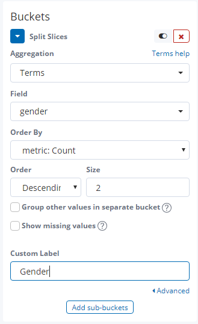
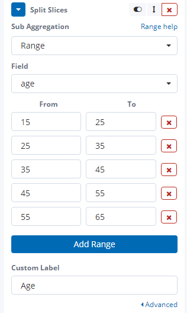
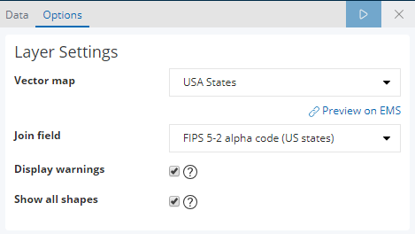

# Exercise 6: _Kibana_ visualizations

The purpose of this exercise is to try out the data visualization capabilities of _Kibana_.

## Create an Index pattern

Our first step is to tell _Kibana_ which indexes it should consider when creating the visualizations.

1. Click on the _Visualize_ tab on the left side menu

    

1. Enter the index name — `salaries` — as the index pattern. Make sure _Kibana_ says _Success! Your pattern matches 1 index_, and click _Next step_.

    

1. Select _I don't want to use the Time Filter_ as _Time Filter field name_ since we are not going to use this function during the exercises. Click on _Create index pattern_.

    

## a) How many people did the companies hire each month between 2010 and 2016? (vertical bar chart)

1. Click on the _plus_ sign on the _Visualize_ tab, and select _Vertical Bar_.

    

1. Select the previously created `salaries` index pattern as the search source.

    

1. Under the _Metrics_ setting set _People hired_ as the _Custom Label_.

    

1. Under the _Buckets_ setting select _X-Axis_, and set the following.

    * _Aggregation_ should be _Date Histogram_
    * _Field_ should be `hired`
    * _Interval_ should be _Monthly_
    * _Custom Label_ should be _Month_

    

1. In the top left corner click on the _Add a filter_ link, and use the following settings to create the filter. Click on _Save_ to save the filter.

    

    > :memo: Create a screenshot of the visualization and save it as `exercise-6\a.png`.

1. Click on the _Save_ button in the top right corner, and save the visualization as `6_a`.

1. Click on the _Management_ tab in the left side menu, and choose the _Saved Objects_ option. Select and export the visualization you just saved.

    

    > :memo: Save the downloaded `export.json` file as `exercise-6\a.json`.

## b) Show the gender and age distribution of the workers! (pie chart)

1. Click on the _plus_ sign on the _Visualize_ tab, and select _Pie_. If you are navigated to the previous visualization when you click on the _Visualize_ tab, then click again.

1. Select the previously created `salaries` index pattern as the search source.

1. Under the _Buckets_ setting select _Split Slices_ and set a _Terms_ aggregation on the `gender` field.

    

1. Click on the _Add sub-buckets_ button, and select _Split Slices_ with a _Range_ aggregation on the `age` field.

    

> :memo: Create a screenshot of the visualization and save it as `exercise-6\b.png`.

> :memo: Use the previous method to save and export the visualization. Save the exported file as `exercise-6\b.json`.

## c) Show the distribution of the workers' locations! (map)

1. Click on the _plus_ sign on the _Visualize_ tab, and select _Region Map_. If you are navigated to the previous visualization when you click on the _Visualize_ tab, then click again.

1. Select the previously created `salaries` index pattern as the search source.

1. Under the _Buckets_ setting select _shape field_ with _Terms_ aggregation on the `address.state` field. Make sure to set the _Size_ value to at least 50.

    

1. Under _Options_ / _Layer Settings_ select _USA States_ as _Vector map_ and _FIPS 5-2 alpha code_ as _Join field_.

    

> :memo: Create a screenshot of the visualization and save it as `exercise-6\c.png`.

> :memo: Save and export the visualization. Save the exported file as `exercise-6\c.json`.

## Next exercise

Next is [exercise 7](exercise7.md).