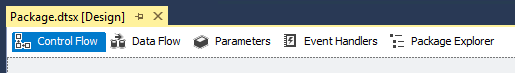
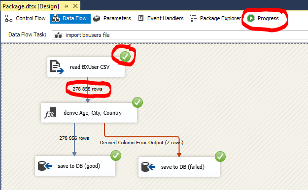

# Microsoft SQL Server Business Intelligence, SQL Server Data Tools for Visual Studio

This guide provides a quick introduction into using Microsoft SQL Server Business Intelligence tools.

## SQL Server Management Studio

If you need to create a new database, or create the tables, use _SQL Server Management Studio_. You need to connect to a _Database engine_, and use the server name and authentication method detailed in the course material.

After successful connection, the databases are listed in the _Object Explorer_. Right click the _Databases_ folder to create a new database. To run a new query click the _New query_ button, write the query, and click _Execute_.

### Typical issues

- "I just created a new database/table, but it does not appear in SSMS"
  - Refresh the list by right clicking the Databases or Tables folder in the _Object explorer_.

## Microsoft SQL Server Data Tools integrated into Visual Studio

After installing Microsoft SQL Server Data Tools, you will find new project types in Visual Studio in the New Project wizard.

The projects themselves contain mostly xml-based descriptions. For production use, these so-called *packages* are published to servers for execution. For debugging purposes Visual Studio is also able to execute the packages.

## Integration Services project

The Integration services project contains a _Package.dtsx_ (visible in Solution Explorer), which, when opened, presents a designer UI. There are two views to this UI: the _Control Flow_ and the _Data Flow_.

Control flow is the high-level component responsible for the execution of the entire process; Data flow contains part of the whole process, a single ETL flow. We build ETL processes by combining the two.

The ETL process is built from the available components by dragging them from the *SSIS toolbox* and connecting them to each other. The _SSIS toolbox_ can be opened from the _View_ menu under _Other Windows_. The settings of each component can edited in the *Properties* box on the right, or by *double clicking* the boxes themselves.

Notable components (from the *SSIS Toolbox*) that you will need:

- Data Flow Task: data extract-transform-load sequence of steps
- Execute SQL Task: execute a command
- ADO NET/ Excel / ODBC/ Flat File / etc. Source/Destination: load or save data to/from
- Derive Column: transform a value or calculate a new value from existing data
- Conditional Split: split the data into two paths based on a condition
- Sort: sorting and duplicate filtering

We can debug the process using the **Debug** button in the toolbar. During the execution we will get immediate feedback on the progress and the result. The detailed log can be viewed by clicking the **Progress** button, or in the **Output window**.

### Typical issues

- "The integration services project failed to execute"
  - Check the log in the _Progress_ view, and locate the first error.
- "I changed the properties of a connection manager and nothing works now"
  - You need to open the data input or output component by double clicking it. It will update the changes made to the connection manager.
- "CSV import fails" if you removed columns in the flat file source connection manager
  - Do not remove columns in the file source. You will just ignore the unnecessary columns later on.
- "Truncation" related errors
  - You specified incorrect length for in the flat file source connection details.
- "The integration service execution takes too long"
  - If you have multiple sort actions, they may use a lot of memory. Force execution of the steps after each other by specifying a dependency in the control flow view (disables parallelism).

## Reporting Services project

The easiest was to start with a new project is to use the _Reporting Server Project Wizard_. It guides you through creating the project and then a new report. The report is presented in a WYSIWYG manner in a designer surface. You can add new elements from the *Toolbox* (open the toolbox from _View_ menu under
_Other Windows_). The layout and contents is edited here, while the *Properties* of each element is specified in the toolbox on the right. You can also *Preview* the report here.

Every report has a _Data source_, which is the connection to the database. You need to create this manually, or if you used the wizard to create the project, it may already exist.

A _Data set_ specifies the query that will fetch the data the report displays. Typically you create one data set for each component (table, diagram, etc.) you add to the report. The result of this query can be bound to fields of the report, e.g. display it in one column of the table.

You can find these in the _Report Data_ window (open it from the _View_ menu).

A report project can contain multiple reports. You can add new ones using the Solution Explorer.

